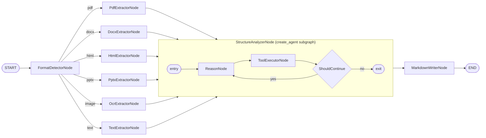

# MAKE.md — md-bot 개발 기록

## 프로젝트 개요

**md-bot**은 모든 문서 포맷(PDF, DOCX, HTML, PPTX, 이미지, 텍스트/CSV)을 입력받아 AI가 구조를 해석한 후 `.md` 파일로 변환하는 LangGraph 기반 에이전트 파이프라인입니다.

---

## 개발 세션 요약 (2026-04-21)

### 1단계: 아키텍처 설계 (`@architecting-act`)

- **스킬 적용:** `architecting-act` 스킬 로드 → Mode 1 (Initial Design) 적용
- **결정 사항:**
  - 입력 포맷: 모든 문서 (PDF, DOCX, HTML, PPTX, 이미지, 텍스트/CSV)
  - 변환 방식: AI가 문서 구조를 해석하여 MD 생성
  - 캐스트 이름: `md_converter` (기존 `oke` boilerplate 대체)
  - 패턴: **Branching + Sequential**
    - FormatDetectorNode → 포맷별 추출기 6종 → StructureAnalyzerAgent → MarkdownWriterNode

#### 확정된 아키텍처 다이어그램



---

### 2단계: 문서 생성

| 파일 | 내용 |
|------|------|
| `/CLAUDE.md` | Act 개요, Casts 테이블, 프로젝트 구조, 개발 명령어 |
| `/casts/md_converter/CLAUDE.md` | 아키텍처 다이어그램, 노드 명세, 캐스트 구조 |

---

### 3단계: 구현 (`@developing-cast`)

**구현 순서:** state → prompts → tools → models → agents → nodes → conditions → graph

#### 생성된 파일

| 파일 | 역할 |
|------|------|
| `casts/md_converter/__init__.py` | `md_converter_graph` export |
| `casts/md_converter/pyproject.toml` | 캐스트 의존성 (pdfplumber, python-docx 등) |
| `casts/md_converter/graph.py` | `MdConverterGraph` — 그래프 조립 및 컴파일 |
| `modules/state.py` | `InputState`, `OutputState`, `State` TypedDict |
| `modules/prompts.py` | `StructureAnalyzerAgent` 시스템 프롬프트 |
| `modules/tools.py` | `detect_headings`, `detect_tables`, `detect_code_blocks`, `detect_lists` |
| `modules/models.py` | `get_structure_analyzer_model()` — gpt-4o-mini |
| `modules/agents.py` | `set_structure_analyzer_agent()` — create_agent 팩토리 |
| `modules/nodes.py` | 9개 노드 전체 구현 |
| `modules/conditions.py` | `route_by_format()` — 포맷별 라우팅 |

#### 노드 상세

| 노드 | 타입 | 라이브러리 |
|------|------|-----------|
| `FormatDetectorNode` | Custom | `mimetypes`, 확장자 매핑 |
| `PdfExtractorNode` | Custom | `pdfplumber` |
| `DocxExtractorNode` | Custom | `python-docx` |
| `HtmlExtractorNode` | Custom | `BeautifulSoup4` |
| `PptxExtractorNode` | Custom | `python-pptx` |
| `OcrExtractorNode` | Custom | `pytesseract`, `Pillow` |
| `TextExtractorNode` | Custom | 내장 파일 I/O (CSV → 파이프 테이블 변환 포함) |
| `StructureAnalyzerNode` | create_agent subgraph | `langchain-openai`, `gpt-4o-mini` |
| `MarkdownWriterNode` | Custom | 내장 파일 I/O |

#### 상태 필드

| 필드 | 타입 | 설명 |
|------|------|------|
| `file_path` | `str` | 입력 문서 경로 |
| `output_dir` | `str` | 출력 `.md` 저장 디렉터리 |
| `file_format` | `str` | 감지된 포맷 (`pdf`\|`docx`\|`html`\|`pptx`\|`image`\|`text`) |
| `raw_content` | `str` | 추출기 출력 원문 |
| `structured_content` | `dict` | AI 분석 결과 (headings, tables, code_blocks, lists, paragraphs) |
| `markdown_output` | `str` | 최종 MD 문자열 |
| `output_path` | `str` | 저장된 `.md` 파일 경로 |

#### 설정 변경

- `langgraph.json` — `md_converter` 그래프 등록
- `pyproject.toml` (루트) — 의존성 추가 (`langchain-openai`, `pdfplumber` 등)

---

### 4단계: oke 캐스트 제거

- `casts/oke/` 디렉터리 삭제
- `tests/cast_tests/oke_test.py` 삭제
- `langgraph.json`에서 `oke` 항목 제거

---

### 5단계: 테스트 작성 (`@testing-cast`)

#### 생성된 테스트 파일

| 파일 | 테스트 대상 |
|------|------------|
| `tests/conftest.py` | 공용 fixtures (파일, 상태, mock agent) |
| `tests/node_tests/test_md_converter_nodes.py` | 9개 노드 유닛 테스트 (~35개) |
| `tests/cast_tests/test_md_converter_graph.py` | 라우팅 + 그래프 통합 테스트 (~10개) |

#### 테스트 전략

- 외부 라이브러리(`pdfplumber`, `pytesseract`, `docx`, `pptx`)는 `unittest.mock.patch`로 모킹
- AI 에이전트는 `MagicMock`으로 대체 — 실제 OpenAI 호출 없음
- 파일 I/O는 pytest `tmp_path` fixture 활용
- 포맷 라우팅은 `@pytest.mark.parametrize`로 18개 확장자 전수 테스트

---

### 6단계: GitHub 싱크

```
Remote: https://github.com/WithModulabs/md-bot.git
Branch: main
Commit: feat: implement md_converter cast - document to Markdown pipeline
Files:  194개
```

---

## 실행 방법

### 의존성 설치

```bash
uv sync
# 또는
pip install pdfplumber python-docx beautifulsoup4 python-pptx pytesseract Pillow langchain-openai
```

### 환경 변수

```bash
# .env 파일 생성
OPENAI_API_KEY=your_key_here
```

### 개발 서버 실행

```bash
uv run langgraph dev
```

### 테스트 실행

```bash
uv run pytest tests/ -v
```

### 그래프 호출 예시

```python
from casts.md_converter.graph import md_converter_graph

result = md_converter_graph.invoke({
    "file_path": "/path/to/document.pdf",
    "output_dir": "/path/to/output"
})

print(result["output_path"])      # /path/to/output/document.md
print(result["markdown_output"])  # Markdown 문자열
```

---

## 주의사항

- **이미지 OCR:** 시스템에 [Tesseract](https://github.com/UB-Mannheim/tesseract/wiki) 별도 설치 필요
- **DOCX 테이블:** `python-docx`의 내부 XML 파싱 방식으로 구현되어 있어 복잡한 병합 셀은 지원 제한
- **StructureAnalyzerNode:** `OPENAI_API_KEY` 없으면 실패 — 테스트는 mock으로 우회됨
