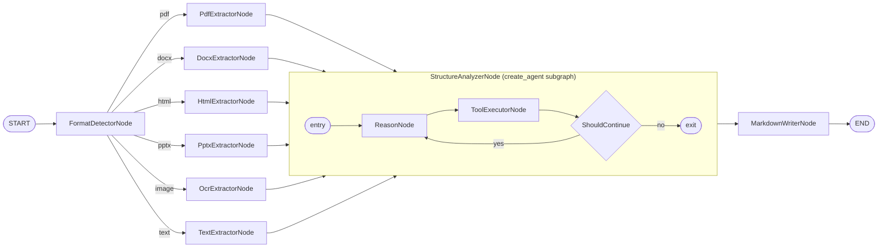

<!-- AUTO-MANAGED: cast-overview -->
## Overview

**Cast:** md_converter  
**Purpose:** Convert any document (PDF, DOCX, HTML, PPTX, image, plain text/CSV) into a structured `.md` file.  
**Pattern:** Branching (format detection → format-specific extractor) + Sequential (extractor → AI structure analysis → Markdown writer)  
**Latency:** Medium (AI analysis step ~2–5 s; extractor steps deterministic)

<!-- END AUTO-MANAGED -->

<!-- AUTO-MANAGED: architecture-diagram -->
## Architecture Diagram



<!-- END AUTO-MANAGED -->

<!-- AUTO-MANAGED: node-specifications -->
## Node Specifications

| Node | Type | Responsibility |
|------|------|----------------|
| `FormatDetectorNode` | Custom (BaseNode) | Detect file format from extension/MIME type → write `file_format` |
| `PdfExtractorNode` | Custom (BaseNode) | Extract text + layout from PDF using `pdfplumber` → write `raw_content` |
| `DocxExtractorNode` | Custom (BaseNode) | Extract paragraphs, headings, tables from DOCX using `python-docx` → write `raw_content` |
| `HtmlExtractorNode` | Custom (BaseNode) | Parse h1–h6, lists, code blocks, tables from HTML using `BeautifulSoup` → write `raw_content` |
| `PptxExtractorNode` | Custom (BaseNode) | Extract slide titles and body text by section using `python-pptx` → write `raw_content` |
| `OcrExtractorNode` | Custom (BaseNode) | Run OCR on image files via `pytesseract` → write `raw_content` |
| `TextExtractorNode` | Custom (BaseNode) | Read plain text or CSV directly; CSV rows hinted as pipe-table rows → write `raw_content` |
| `StructureAnalyzerNode` | create_agent subgraph | Interpret `raw_content`, infer headings/tables/code-block structure using tools, write `structured_content` |
| `MarkdownWriterNode` | Custom (BaseNode) | Render `structured_content` into Markdown string, save `.md` file, write `output_path` |

**StructureAnalyzerNode tools:** `detect_headings`, `detect_tables`, `detect_code_blocks`, `detect_lists`

<!-- END AUTO-MANAGED -->

<!-- AUTO-MANAGED: cast-structure -->
## Cast Structure

```
casts/md_converter/
├── __init__.py
├── graph.py
├── pyproject.toml
└── modules/
    ├── __init__.py
    ├── state.py
    ├── models.py
    ├── tools.py
    ├── agents.py
    ├── nodes.py
    ├── conditions.py
    └── prompts.py
```

<!-- END AUTO-MANAGED -->

<!-- AUTO-MANAGED: development-commands -->
## Development Commands

```bash
# Add a dependency to this cast
uv add --package md_converter <package>

# Remove a dependency from this cast
uv remove --package md_converter <package>
```

<!-- END AUTO-MANAGED -->

<!-- MANUAL -->
## Notes

Add cast-specific notes here. This section is never auto-modified.

<!-- END MANUAL -->
